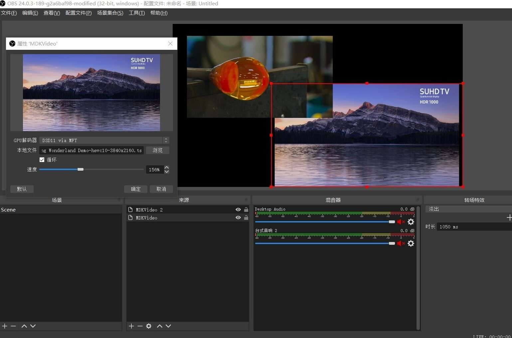

A Video Playback Plugin for OBS Studio. Based on [mdk-sdk](https://github.com/wang-bin/mdk-sdk)

Features
- Best performance: hardware decoding and rendering for all platforms
- Playlist
- Playback control via hotkey(Settings=>Hotkeys=>MDKVideo)

NOTE: to use OpenGL renderer on windows, libEGL.dll and libGLESv2.dll in obs-plugins must be deleted

Screen Shots

